 
## 查看主页获取源码

### 一、作品包含

源码+数据库+设计文档万字+PPT+全套环境和工具资源+部署教程

### 二、项目技术

前端技术：Html、Css、Js、Vue、Element-ui

数据库：MySQL

后端技术：Java、Spring Boot、MyBatis

  

### 三、运行环境

开发工具：IDEA/eclipse

数据库：MySQL5.7

数据库管理工具：Navicat10以上版本

环境配置软件： JDK1.8+Maven3.6.3

前端Nodejs：14

### 四、项目介绍
项目编号：springbootA177

个人博客系统是为了帮助用户记录生活点滴、分享知识经验、展示个人才华而开发的。系统以个人博客为核心，结合互联网时代信息传播的特点，旨在为用户提供一个便捷、高效、个性化的博客管理平台。通过该系统，用户可以轻松地发布文章，帮助用户更好地传播个人观点和内容，拓展社交圈，提升个人影响力。此外，个人博客系统还具备良好的用户体验和可扩展性，为用户带来愉悦的博客创作和阅读体验。

前台用户功能：浏览首页、博文信息、博客相册、新闻资讯、留言板、后台管理和个人中心。

后台分为管理员和博主
管理员的功能：系统首页、个人中心、博主管理、博文信息管理、博文类型管理、博客相册管理、留言板管理、系统管理。
博主的功能：系统首页、个人中心、博文信息管理、博客相册管理。

### 五、运行截图

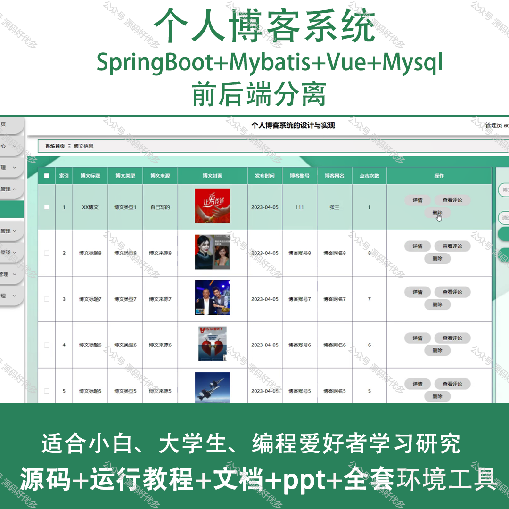
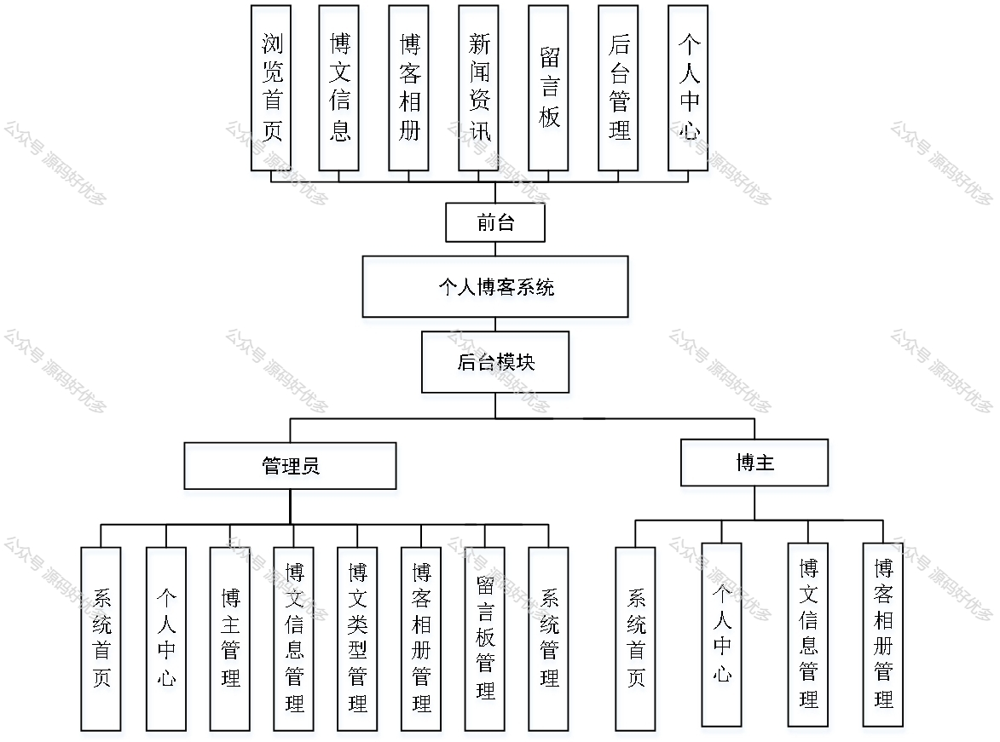
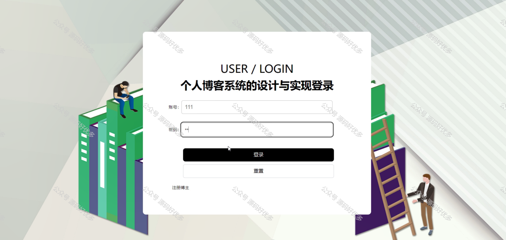
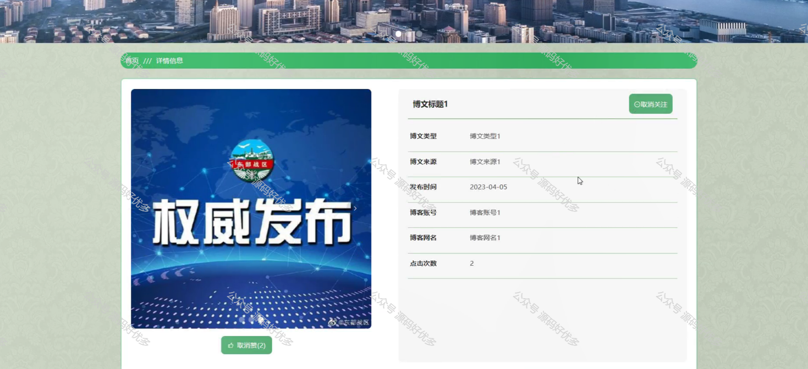
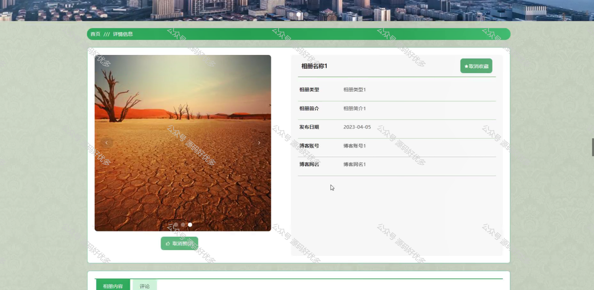
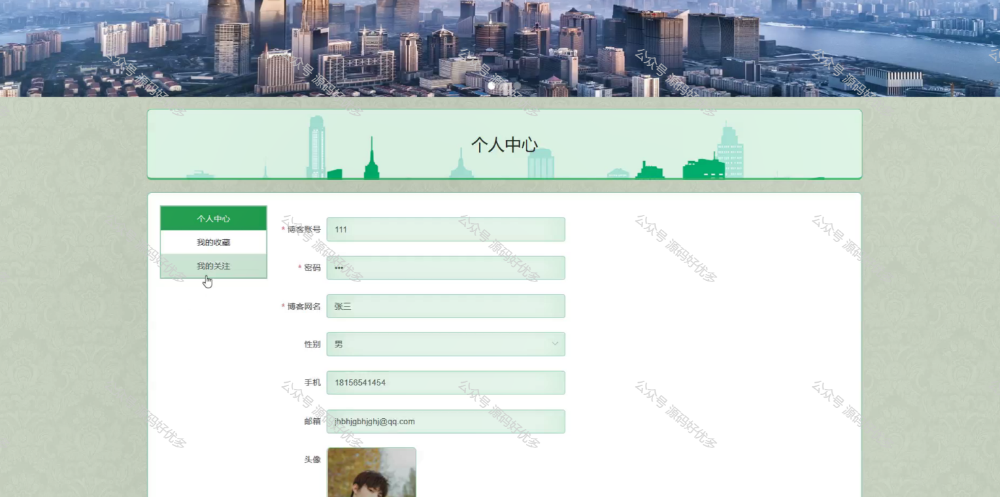
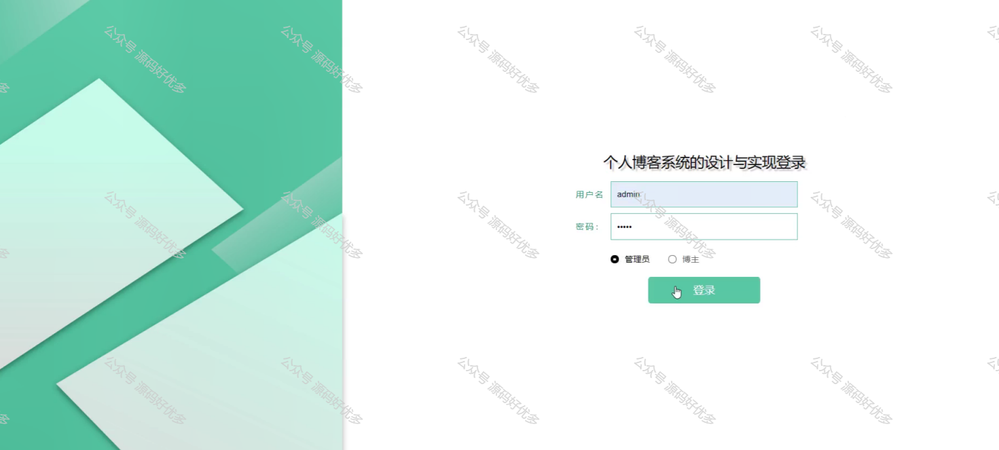
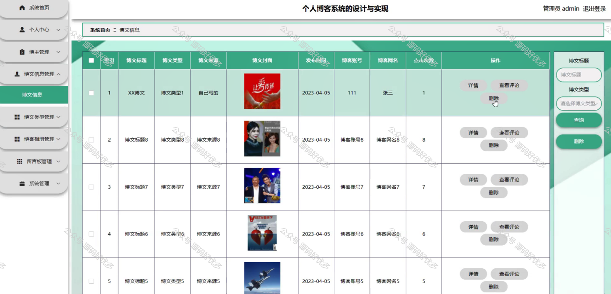
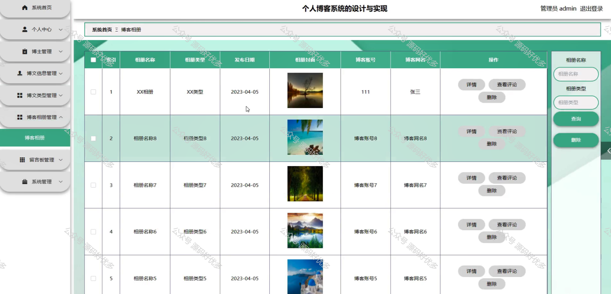
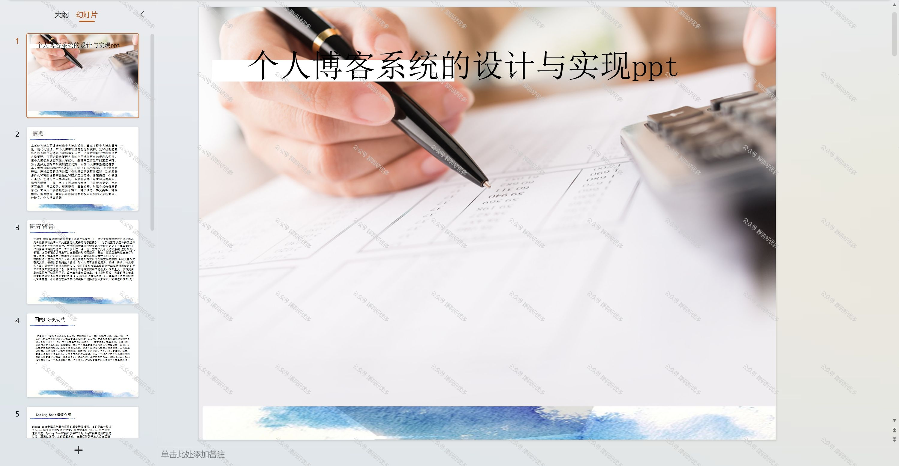
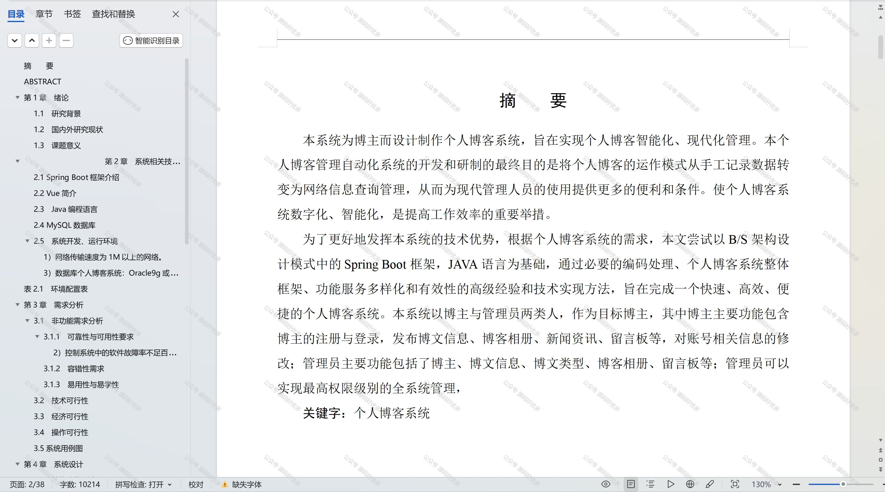

  
